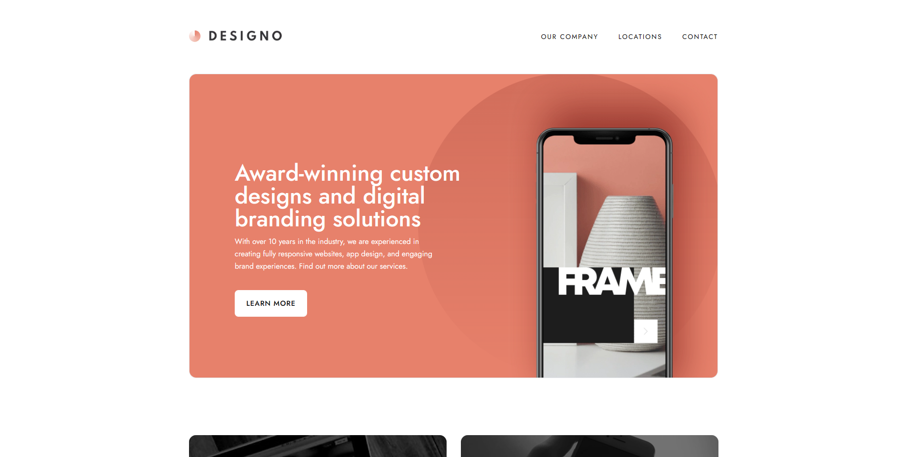

# Frontend Mentor - Designo agency website solution

This is a solution to the [Designo agency website challenge on Frontend Mentor](https://www.frontendmentor.io/challenges/designo-multipage-website-G48K6rfUT). Frontend Mentor challenges help you improve your coding skills by building realistic projects.

## Table of contents

- [Overview](#overview)
  - [The challenge](#the-challenge)
  - [Screenshot](#screenshot)
  - [Links](#links)
- [My process](#my-process)
  - [Built with](#built-with)
  - [What I learned](#what-i-learned)
  - [Continued development](#continued-development)
  - [Useful resources](#useful-resources)
- [Author](#author)
- [Acknowledgments](#acknowledgments)

## Overview

### The challenge

Users should be able to:

- View the optimal layout for each page depending on their device's screen size
- See hover states for all interactive elements throughout the site
- Receive an error message when the contact form is submitted if:
  - The `Name`, `Email Address` or `Your Message` fields are empty should show "Can't be empty"
  - The `Email Address` is not formatted correctly should show "Please use a valid email address"
- **Bonus**: View actual locations on the locations page maps (we recommend [Leaflet JS](https://leafletjs.com/) for this)

### Screenshot



### Links

- Live Site URL: [Add live site URL here](https://designo-multipage-frontend-mentor.vercel.app/)

## My process

### Built with

- Mobile-first workflow
- [React](https://reactjs.org/) - JS library
- [Next.js](https://nextjs.org/) - React framework
- [TailwindCSS](https://tailwindcss.com/docs/) - For styles

### What I learned

```html
<h1>Some HTML code I'm proud of</h1>
```

```css
.proud-of-this-css {
  color: papayawhip;
}
```

```js
const proudOfThisFunc = () => {
  console.log("🎉");
};
```

### Continued development

Use this section to outline areas that you want to continue focusing on in future projects. These could be concepts you're still not completely comfortable with or techniques you found useful that you want to refine and perfect.

**Note: Delete this note and the content within this section and replace with your own plans for continued development.**

## Author

- Website - [Angelo Longoria](https://www.angelolongoria.dev)
- Frontend Mentor - [@yourusername](https://www.frontendmentor.io/profile/arlongoria93)
